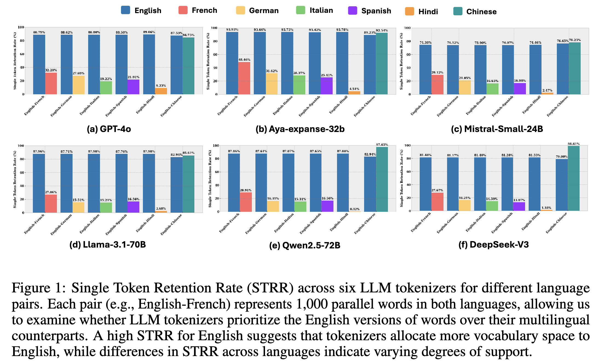

## STRR: Single Token Retention Rate

This is the official repository for our paper, titled ["Beyond Fertility: Analyzing STRR as a Metric for Multilingual Tokenization Evaluation,"](https://arxiv.org/abs/2510.09947) published at the [NeurIPS 2025 Workshop](https://sites.google.com/view/llm-eval-workshop/home) on Evaluating the Evolving LLM Lifecycle: Benchmarks, Emergent Abilities, and Scaling.

The Single Token Retention Rate (**STRR**) is a novel, interpretable metric proposed for evaluating the fairness and efficiency of multilingual tokenizers. Unlike the traditional metric of fertility, STRR directly measures the proportion of words preserved as single tokens across languages. This metric is designed to reveal systematic biases and inequities in vocabulary allocation, unlike token-level average metrics, STRR is a **type-level diagnostic**, which makes it effective at probing vocabulary allocation fairness.

Our analysis using STRR reveals the systematic prioritization of **English**, strong support for **Chinese**, and pronounced fragmentation in languages like **Hindi** across six widely used LLM tokenizers. STRR complements fertility and provides actionable guidance for designing more equitable multilingual tokenizers.

<p align="center">
  
</p>

---

## 📦 Repository Contents

* **`code/`**: Contains the Python notebooks necessary for calculating the **STRR** metric across the evaluated LLM tokenizers.
* **`data/`**: Includes the curated, open-access multilingual wordlists used to define the STRR reference. This data comprises **1,000 parallel translation pairs** of the most frequent words in seven major languages (English, German, French, Spanish, Italian, Hindi, and Chinese).
* **`plots/`**: Stores the generated visualizations, including the key **STRR bar charts**. These figures illustrate the varying degrees of whole-word retention across languages and tokenizers, highlighting cross-lingual inequities. 


## Citation Information

If you use any of the resources or it's relevant to your work, please cite our [NeurIPS 2025 Workshop paper](https://arxiv.org/abs/2510.09947). 

```
@misc{nayeem2025strrmetric,
      title={Beyond Fertility: Analyzing STRR as a Metric for Multilingual Tokenization Evaluation}, 
      author={Mir Tafseer Nayeem and Sawsan Alqahtani and Md Tahmid Rahman Laskar and Tasnim Mohiuddin and M Saiful Bari},
      year={2025},
      eprint={2510.09947},
      archivePrefix={arXiv},
      primaryClass={cs.CL},
      url={https://arxiv.org/abs/2510.09947}, 
}
```